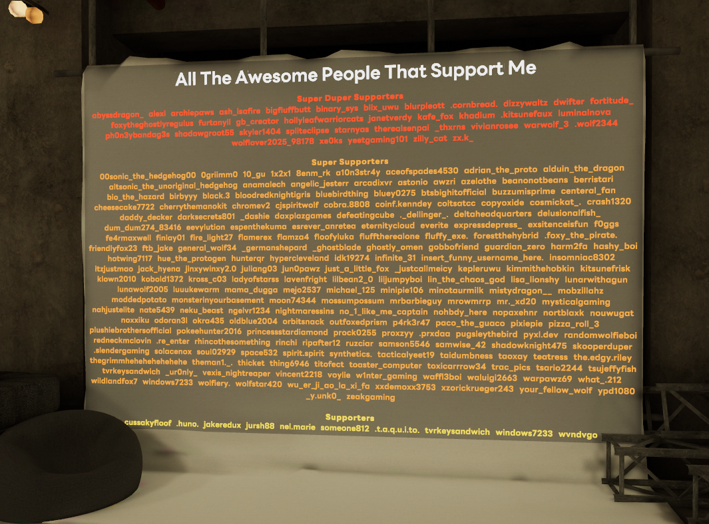

# VRC-SupporterBot
"VRC-SupporterBot" solves the problem of keeping an updated list of supporters in your VRChat world. 

Instead of having to copy and paste usernames, this program automates the entire process for you, without requiring you to re-upload the world each time someone supports you.

Read [the wiki](https://github.com/peri-perihelion/VRC-SupporterBot/wiki) for setup instructions, and additional information about the program.  
This program can be seen in use at [Arti's Avatar World](https://vrchat.com/home/launch?worldId=wrld_186c5fde-7f65-4cf8-a68d-f828690004fc).

*If you use this tool, get in contact! Id love to list your world here!*

### Prerequisites:
- You must have a Discord Server where all of your supporters are gathered in
- You must use a Discord Bot to automatically assign supporter roles, like the official Ko-fi and Patreon ones

### Overview (heavily simplified)
- Running the program
  1. Using the Discord Bot API, we make a list of each supporter in your server
  2. Using the GitHub API, we upload this list to a Gist file
  3. The program exits, having updated the list successfully
- When someone joins your world
  1. A Udon script downloads your Gist file
  2. Your supporters are displayed in your world on a text box

Updating your supporter list can be done any time you want, simply by opening the program. 
Theres no need to pay for any servers, run anything in the background, or do any time consuming world updates.
As the list updates on Github, it updates in VRChat, saving you from the otherwise tedious and repetitive process of updating a textbox by hand.
